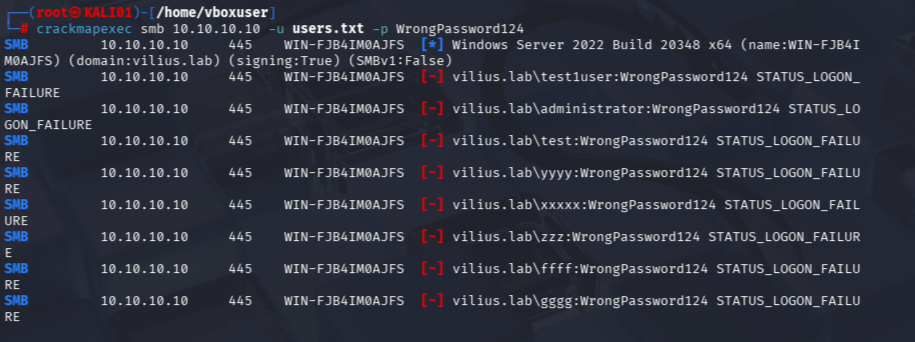
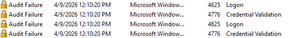
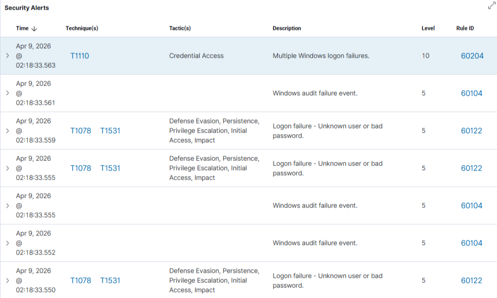
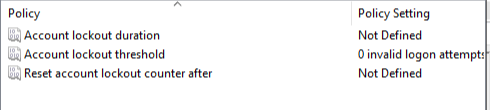
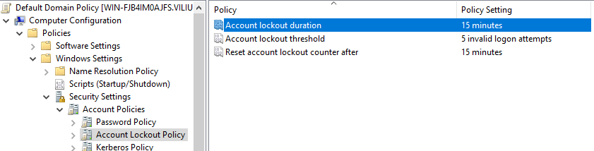
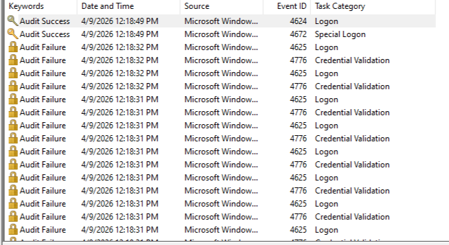
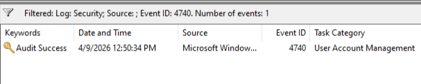

# T1110.003 Password Spraying

## Objective

Simulate a password spraying attack against Active Directory users, detect the activity using Wazuh SIEM, and validate defensive controls.

---

## Attack

**Tool used:**

* crackmapexec

**Command:**

```
crackmapexec smb 10.10.10.X -u users.txt -p WrongPassword123
```


**Description:**
A password spraying attack was performed by attempting authentication with a common password across multiple domain user accounts.

**Result:**

* Multiple failed authentication attempts were generated across domain users.
* No account lockouts occurred during this phase.




---

## Detection

### Windows Event Logs

* **Event ID 4625** — Failed logon attempts

### Wazuh SIEM

* Rule triggered: **T1110 – Multiple Windows logon failures**
* Alert level: **High (Level 10)**
* Detection based on correlation of multiple failed logon events



---

## Issues Encountered

### 1. Wazuh Agents Disconnected

**Impact:**

* No log ingestion into SIEM
* Detection pipeline was non-functional

**Root Cause:**

* Incorrect Wazuh manager IP in agent configuration
* Missing/invalid agent authentication keys

**Resolution:**

* Re-registered agents using `agent-auth`
* Updated `ossec.conf` with correct Wazuh manager IP
* Restarted agent services

---

### 2. Missing Event ID 4740 (Account Lockout)

**Impact:**

* Account lockout events were not visible in logs or SIEM

**Root Cause:**

* Audit policy for **User Account Management** was not enabled

**Resolution:**

```
auditpol /set /subcategory:"User Account Management" /success:enable /failure:enable
```



---

## Hardening

Implemented **Account Lockout Policy** via Group Policy:

* Lockout threshold: **5 failed attempts**
* Lockout duration: **15 minutes**
* Reset counter after: **15 minutes**




---

## Validation

To validate the lockout policy, repeated authentication attempts were performed against a single user account.

**Result:**

* Account was successfully locked after exceeding threshold
* **Event ID 4740 (Account locked out)** was generated
* Event visibility required filtering due to log volume
* Detection confirmed in both Windows Event Logs and Wazuh SIEM


