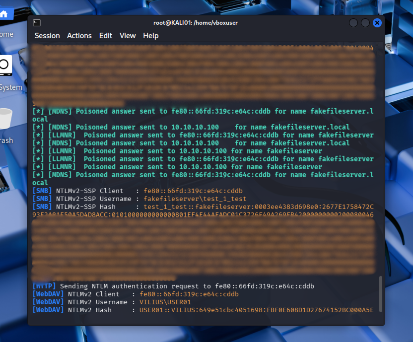
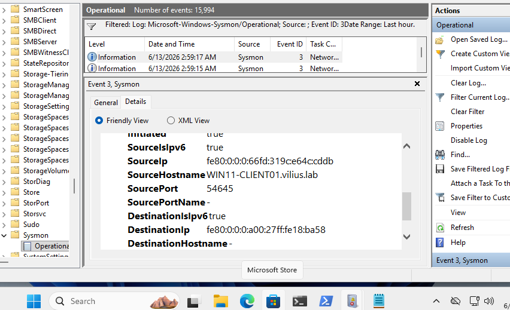
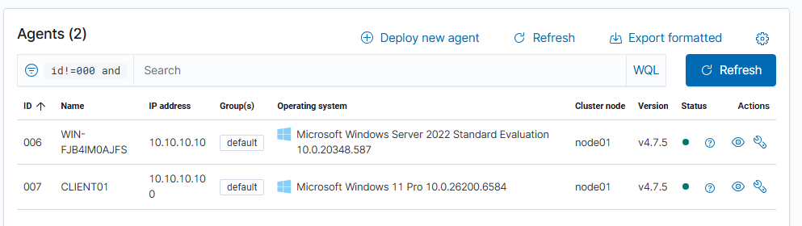
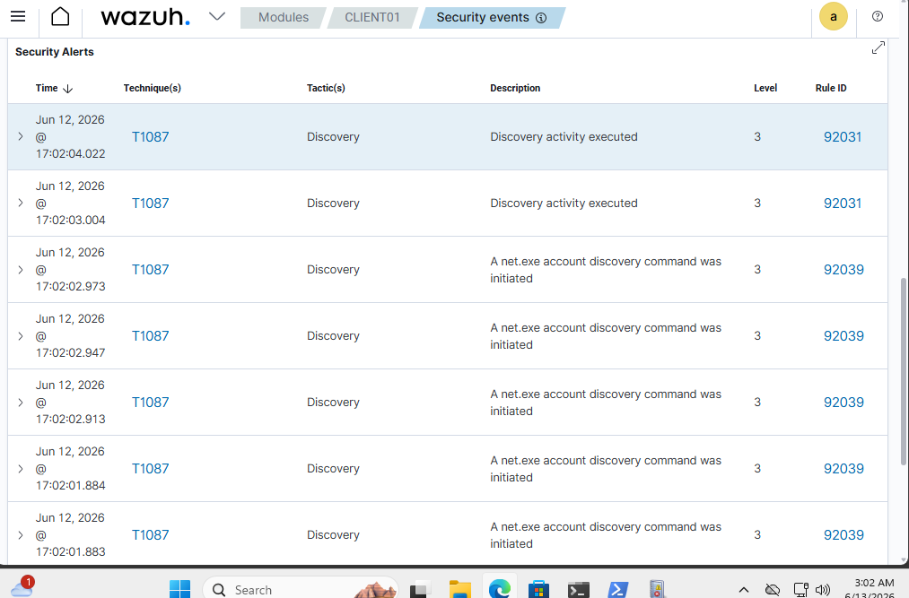
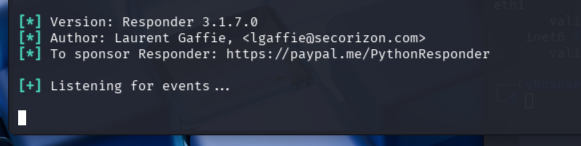

# T1557.001 Name Resolution Poisoning with Responder

## Objective

Simulate a name resolution poisoning attack in a Windows domain lab using Responder, observe credential capture behavior, detect the activity using packet capture, Sysmon, and Wazuh telemetry, then apply hardening controls and validate whether the attack is reduced or blocked.

This scenario focuses on multicast/local name resolution abuse involving:

* LLMNR
* NBT-NS
* mDNS
* SMB / WebDAV authentication behavior

---

## Lab Context

This scenario was performed inside a VirtualBox based purple team home lab.

### Lab Machines

* `DC01` — Windows Server / Active Directory Domain Controller
* `WIN11-CLIENT01` — Domain-joined Windows 11 workstation
* `KALI01` — Attacker machine running Responder
* `WAZUH01` — SIEM / endpoint telemetry collection
* `pfSense` — Lab firewall/router

### Important Network Requirement

LLMNR, NBT-NS, and mDNS are local-network name resolution protocols. For this scenario, Kali needed visibility into the same local network segment as `WIN11-CLIENT01`.

Kali was positioned on the same lab LAN as the Windows client to simulate an internal attacker with access to the workstation subnet.

---

## MITRE ATT&CK Mapping

| Technique | Name                                 |
| --------- | ------------------------------------ |
| T1557.001 | LLMNR/NBT-NS Poisoning and SMB Relay |

Related observed behavior:

| Protocol / Port | Description                                 |
| --------------- | ------------------------------------------- |
| UDP 5355        | LLMNR                                       |
| UDP 137         | NBT-NS                                      |
| UDP 5353        | mDNS                                        |
| TCP 445         | SMB authentication                          |
| TCP 80 / 443    | WebDAV / HTTP-based authentication behavior |

---

## Attack

### Tool Used

* Responder

### Attacker Command

```bash
sudo responder -I ethX -v
```

`ethX` was replaced with the Kali interface connected to the same network as `WIN11-CLIENT01` (`eth1`).

### Victim Trigger

On `WIN11-CLIENT01`, a fake SMB path was requested:

```powershell
net use \\fakefileserver\share
```

Additional fake hostnames were also tested during validation, such as:

```powershell
net use \\fakefileservertest123\share
```

### Result

Responder successfully poisoned name-resolution requests and captured NetNTLMv2 authentication material.

Observed capture types included:

* SMB NTLMv2-SSP authentication
* WebDAV NTLMv2 authentication
* IPv6 link-local client activity



---

## Detection

### Packet / Network Evidence

Kali was used to observe name resolution traffic with packet capture.

Example capture filter:

```bash
sudo tcpdump -ni ethX 'udp port 5355 or udp port 137 or udp port 5353'
```

This helped confirm that the Windows client was generating multicast/local name resolution traffic.

---

### Sysmon Detection

Sysmon Event ID 3 was used to observe network connections from `WIN11-CLIENT01`.

Relevant observed indicators included:

| Event Source | Event ID | Meaning                     |
| ------------ | -------: | --------------------------- |
| Sysmon       |        3 | Network connection detected |

Observed network activity included:

* UDP 5355 / LLMNR
* UDP 137 / NBT-NS
* UDP 5353 / mDNS
* TCP 445 / SMB
* IPv6 link-local SMB/WebDAV behavior

Example evidence:



---

### Wazuh Visibility

Wazuh confirmed that endpoint telemetry was being received from both `DC01` and `CLIENT01`.



Wazuh generated generic discovery related alerts during testing, including `net.exe` account discovery activity.



However, Wazuh did not generate a dedicated high confidence LLMNR/NBT-NS poisoning alert by default.

This was documented as a detection gap.

---

## Issues Encountered

### 1. Sysmon Telemetry Was Required

Initially, Wazuh did not show useful LLMNR/NBT-NS-specific alerts.

Local Sysmon Event ID 3 provided better visibility into network connections involving ports `5355`, `137`, `5353`, and `445`.

### 2. Wazuh Did Not Alert on LLMNR/NBT-NS by Default

Wazuh received endpoint telemetry, but did not automatically classify the activity as LLMNR/NBT-NS poisoning.

This showed that raw telemetry and alerting are different things:

* Sysmon showed the network behavior
* Wazuh showed some generic activity
* A dedicated custom detection rule would be needed for stronger SIEM alerting

### 3. Custom Wazuh Rule Broke Manager Startup

A custom Wazuh rule was attempted for Sysmon Event ID 3 traffic to LLMNR/NBT-NS related ports.

The first rule contained invalid XML syntax for a dynamic Windows field, which caused `wazuh-analysisd` to fail and prevented `wazuh-manager` from starting.

The issue was fixed by removing the broken custom rule and restoring a valid placeholder rule in:

```text
/var/ossec/etc/rules/local_rules.xml
```

Valid placeholder:

```xml
<group name="local,">
  <rule id="100001" level="0">
    <description>Local rules placeholder</description>
  </rule>
</group>
```

### 4. DNS Client Service Instability

An attempted mDNS registry hardening change caused the Windows DNS Client service (`Dnscache`) to become unstable.

The VM was restored from a known-good snapshot to preserve lab stability.

After restore, mDNS hardening was handled using safer firewall-based controls instead of modifying DNS Client service parameters directly.

---

## Hardening

The first hardening attempt focused on disabling LLMNR and NetBIOS over TCP/IP.

### Disable LLMNR

LLMNR was disabled using the policy registry path:

```powershell
New-Item -Path "HKLM:\Software\Policies\Microsoft\Windows NT\DNSClient" -Force

New-ItemProperty `
  -Path "HKLM:\Software\Policies\Microsoft\Windows NT\DNSClient" `
  -Name "EnableMulticast" `
  -Value 0 `
  -PropertyType DWord `
  -Force
```

Validation command:

```powershell
reg query "HKLM\Software\Policies\Microsoft\Windows NT\DNSClient" /v EnableMulticast
```

Expected value:

```text
EnableMulticast    REG_DWORD    0x0
```

---

### Disable NetBIOS over TCP/IP

Because `wmic` was not available on the Windows 11 client, PowerShell CIM was used instead.

```powershell
Get-CimInstance Win32_NetworkAdapterConfiguration -Filter "IPEnabled = True" |
Invoke-CimMethod -MethodName SetTcpipNetbios -Arguments @{ TcpipNetbiosOptions = 2 }
```

Validation command:

```powershell
Get-CimInstance Win32_NetworkAdapterConfiguration -Filter "IPEnabled = True" |
Select-Object Description, TcpipNetbiosOptions
```

Expected value:

```text
TcpipNetbiosOptions : 2
```

---

### Firewall-Based Compensating Controls

Because Responder continued capturing credentials through remaining name-resolution and authentication paths, Windows Firewall rules were added to block key traffic.

The controls included blocking:

* LLMNR UDP 5355
* NBT-NS UDP 137
* mDNS UDP 5353
* SMB traffic to the Kali host
* WebDAV / HTTP(S) traffic to the Kali host

Example controls:

```powershell
New-NetFirewallRule -DisplayName "PTLAB Block LLMNR IPv4 Out" -Direction Outbound -Action Block -Protocol UDP -RemoteAddress 224.0.0.252 -RemotePort 5355 -Profile Any

New-NetFirewallRule -DisplayName "PTLAB Block LLMNR IPv6 Out" -Direction Outbound -Action Block -Protocol UDP -RemoteAddress ff02::1:3 -RemotePort 5355 -Profile Any

New-NetFirewallRule -DisplayName "PTLAB Block NBT-NS Out" -Direction Outbound -Action Block -Protocol UDP -RemotePort 137 -Profile Any

New-NetFirewallRule -DisplayName "PTLAB Block mDNS IPv4 Out" -Direction Outbound -Action Block -Protocol UDP -RemoteAddress 224.0.0.251 -RemotePort 5353 -Profile Any

New-NetFirewallRule -DisplayName "PTLAB Block mDNS IPv6 Out" -Direction Outbound -Action Block -Protocol UDP -RemoteAddress ff02::fb -RemotePort 5353 -Profile Any
```

Additional validation controls were added to prevent credential leakage directly to the Kali host:

```powershell
New-NetFirewallRule -DisplayName "PTLAB Block SMB to Kali" -Direction Outbound -Action Block -Protocol TCP -RemoteAddress 10.10.10.101 -RemotePort 445 -Profile Any

New-NetFirewallRule -DisplayName "PTLAB Block WebDAV HTTP to Kali" -Direction Outbound -Action Block -Protocol TCP -RemoteAddress 10.10.10.101 -RemotePort 80,443 -Profile Any
```

---

## Validation

After hardening, the same `net use` trigger was repeated from `WIN11-CLIENT01`.

```powershell
net use \\fakefileservertest123\share
```

Responder was left running on Kali to observe whether new NetNTLMv2 credentials were captured.

### Before Hardening

Responder successfully captured hashes.

Observed evidence:

* LLMNR / NBT-NS / mDNS poisoning activity
* SMB NTLMv2-SSP capture
* WebDAV NTLMv2 capture
* Sysmon Event ID 3 network connection telemetry


### After Hardening

After applying LLMNR, NetBIOS, and firewall-based controls, Responder no longer captured new credentials during the repeated test.



Fresh Sysmon queries were used to check for remaining relevant traffic:

```powershell
$since = (Get-Date).AddMinutes(-5)

Get-WinEvent -FilterHashtable @{
  LogName='Microsoft-Windows-Sysmon/Operational'
  Id=3
  StartTime=$since
} | Where-Object {
  $_.Message -match "DestinationPort: (5355|137|5353|445|80|443)"
} | Select-Object TimeCreated, Id, Message
```

Validation goal:

* No fresh UDP 5355 LLMNR traffic
* No fresh UDP 137 NBT-NS traffic
* No useful UDP 5353 mDNS poisoning path
* No SMB/WebDAV authentication sent to Kali
* No new Responder hash capture

---

## Final Result

The initial hardening attempt reduced some name resolution traffic but did not fully stop credential capture.

Responder continued capturing NetNTLMv2 material until additional firewall-based controls were applied.

Final validation showed that the same trigger no longer produced a new Responder hash capture.

---

## Key Observations

* Disabling only one protocol is not enough.
* LLMNR, NBT-NS, and mDNS must be considered separately.
* SMB/WebDAV are not name resolution protocols, but they are common follow up paths where credentials can leak after poisoning succeeds.
* IPv6 link-local traffic can still appear even when focusing on IPv4 controls.
* Sysmon Event ID 3 provided strong endpoint visibility into network behavior.
* Wazuh did not provide a dedicated LLMNR/NBT-NS poisoning alert by default.
* Custom SIEM rules must be tested carefully before deployment.
* A malformed Wazuh rule can break the manager and create a visibility gap.

